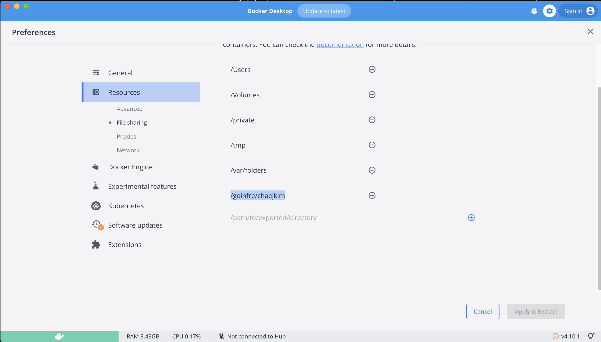

# ft_transcendence_docker_test
백엔드, 프론트엔드 코드가 레포지토리로 따로 관리되기 때문에, 도커 테스트 레포지토리를 따로 팠습니다.
여기서 code review 완료되면, 진짜 ft_transcendence, front-end, back-end 레포지토리에 풀리퀘를 올리겠습니다.

## 사용법

1. 클론 후, 서브모듈에 Dockerfile 과 nginx config 파일 복사  
	```
	git clone --recursive git@github.com:42MVP/ft_transcendence_docker_test.git
	make cp
	```

	- git clone 시 recursive 옵션을 주지 않으면, 클론 후 다음 명령어가 필요합니다.
		- `git submodule update --init --recursive`


2. 도커 이미지 빌드 및 컨테이너 실행

	- 2.1 develope 모드 사용시
		- build   
		```
		make dev  
		```
		- up, down, stop, start    
		```
		make dev-up  
		make dev-down  
		make dev-stop  
		make dev-start  
		```
	
	- 2.2 production 모드 사용시
		- build
			```
			make build
			```
		- up, down, stop, start
			```
			make up
			make down
			make stop
			make start
			```

3. 기타 명령어
	- bind 된 volume 삭제 : `make clear` (파일 소유자가 docker container의 유저 이므로, sudo 권한 필요)
	- 도커 볼륨 삭제 : `make clean`
	- 도커 이미지, 도커 볼륨, 도커 네트워크 삭제 : `make fclean`
	- 도커 이미지, 도커 볼륨, 도커 네트워크 삭제 후 production 모드 build : `make re`

## 기타 문제 사항

- develop 모드에서 mount 에러시 해결법
	- [에러] 대충 `mkdir /Users/chaejkim/goinfre/ft_transcendence_docker_test/frontend/src` 실패 어쩌고 뜨는 경우
	- [해결법] docker desktop > ⚙️ > Resources > File sharing 에서 해당 경로 등록
		- 
